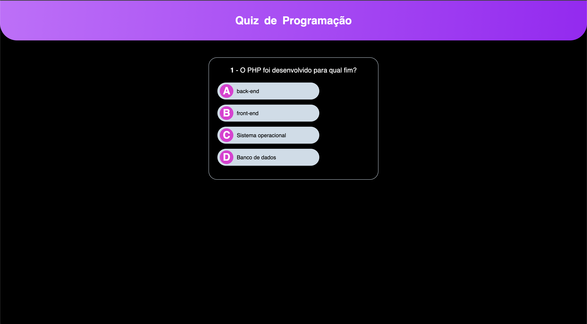

# Projeto Quiz com JavaScript (Manipulação e Eventos)

### Projeto prático criado a partir do curso intensivo de JavaScript do Básico ao Avançado (c/ Node.js e projetos) da <a href="https://www.udemy.com/"> Udemy</a>.

Durante o curso intensivo de JavaScript, o Quiz de Programação foi criado com toda a interface em HTML e CSS responsivo, flexbox, efeitos de hover e um fluxo de jogo no javascript com toda a lógica do quiz.

Por enquanto há somente uma sequência de três perguntas que foram feitas durante o curso, mas a ideia é inserir minhas próprias perguntas até para tornar o quiz mais divertido. 🤩

- Deploy:

## Índice

- <a href="#sobre-o-jogo">Sobre o projeto</a>
- <a href="#aparência-do-jogo">Aparência do jogo</a>
- <a href="#tecnologias-utilizadas">Tecnologias utilizadas</a>
- <a href="#desenvolvido-por"> Desenvolvido por</a>

## 📝Sobre o jogo

O projeto funciona com eventos de acertar ou errar a pergunta, então logo abaixo temos uma pergunta e caso você erre, automaticamente o quiz mostra o erro em vermelho em torno de 1 segundo, trazendo a resposta certa.

Ao acertar a questão a cor verde fica em evidência automaticamente demonstrando que você acertou. Logo, ao final do quiz a sua pontuação é computada com dados dinâmicos referente as perguntas acertadas e/ou erradas, tendo a opção de refazer o quiz para testar novamente as suas habilidades.

## ✅Aparência do jogo

Referente a aparência do quiz achei legal fazer algumas modificações em relação ao original como a aplicação de uma cor gradiente na caixa do título "Quiz de Programação", a cor de fundo preto e o mais bacana, a animação no título. Com essa animação vocês podem ver que cada uma das letras do título estarão animadas quando a página for carregada, fazendo com que elas deslizem de cima para baixo e se tornem visíveis.

https://github.com/amandaadev/project-udemy-quizz/assets/116441572/8ff0cbb1-b99a-4bf6-8e1c-5b9864f547a0

### Vamos lá! Teste seus conhecimentos com o Quiz de Programação 👊

## 🛠Tecnologias utilizadas

 
 

## 👩🏽‍💻Desenvolvido por

### `Amanda Hellen` durante o <strong>Curso de JavaScript do básico ao avançado (c/ Node.js e projetos)</strong> da Udemy.

## Licença 📌

Esse projeto está sob a licença MIT. Veja o arquivo [LICENSE](LICENSE) para mais detalhes.
